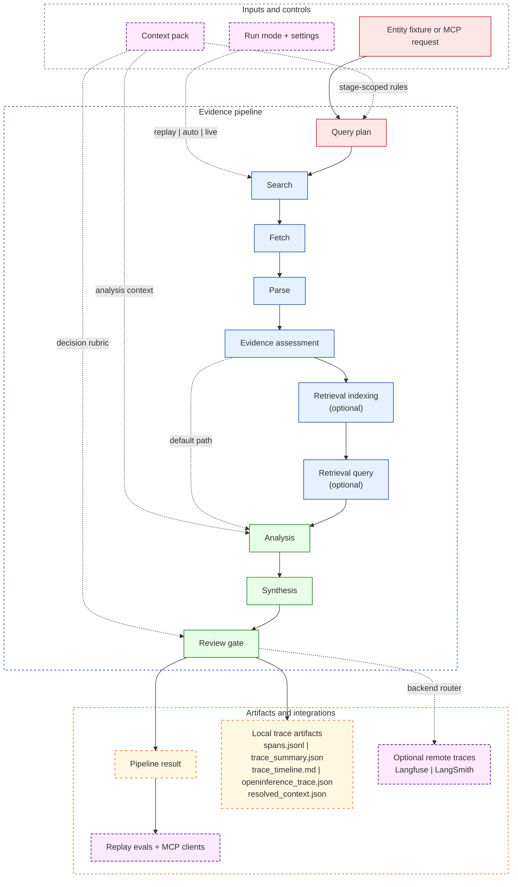

# Evidence Enrichment Engine

`evidence_enrichment` is a public-safe reconstruction of a production evidence-backed enrichment workflow. The repo is intentionally narrow: one entity fixture, one target field, one coordinator, one replay-first contract, and one inspectable decision path.

## Why This Repo Is Worth Reviewing

| Signal | Why it matters to a technical reviewer |
|---|---|
| Replay-first contract | The default demo path is deterministic, zero-network, and regression-friendly. |
| Context pack as runtime data | Stage-scoped instructions live in files, resolve into `resolved_context.json`, and stay inspectable after every run. |
| Explicit evidence pipeline | Query planning, search, fetch, parse, assessment, analysis, synthesis, and review are separate stages with local traces. |
| Optional LangGraph retrieval path | Retrieval can stay off, run as local RAG, or run as a stateful retrieve-evaluate-refine loop without changing the base artifact contract. |
| Langfuse-first observability | `OBSERVABILITY_BACKEND` routes traces to Langfuse, LangSmith, both, or neither while local artifacts remain on by default. |
| AI FinOps for agentic workflows | Per-stage cost estimation, budget-aware execution, and quality/latency/cost tradeoff reporting — all deterministic and replay-friendly. |
| MCP surface | MCP-compatible clients can invoke the replay-safe workflow without inventing a second integration layer. |

## Architecture At A Glance



Deep dives:

- [Goals and features](docs/goals_and_features.md)
- [Retrieval architecture](docs/retrieval.md)
- [Observability model](docs/observability.md)

## Quick Start

```bash
python -m venv .venv
. .venv/bin/activate
python -m pip install -e ".[dev]"

evidence-enrich demo --mode replay
evidence-enrich eval
```

Optional extras:

| Need | Install |
|---|---|
| Live providers | `python -m pip install -e ".[live]"` |
| Retrieval and LangGraph | `python -m pip install -e ".[retrieval]"` |
| Langfuse remote tracing | `python -m pip install -e ".[observability]"` |
| MCP server | `python -m pip install -e ".[mcp]"` |
| Guardrails extras | `python -m pip install -e ".[guardrails]"` |

## Execution Modes

### Pipeline mode

| Mode | What it does | Typical use |
|---|---|---|
| `replay` | Forces replay bundles; no provider API keys or network access required | Default demo and regression work |
| `auto` | Tries live providers when credentials are present, otherwise falls back to replay when a bundle exists | Developer convenience |
| `live` | Forces live provider calls | Manual end-to-end validation |

### Retrieval mode

| `retrieval.mode` | Behavior |
|---|---|
| `off` | Default path. `analysis` uses the parsed document text directly. |
| `local` | Accepted documents are chunked, embedded into Chroma, and queried before `analysis`. |
| `agent` | Wraps retrieval in a LangGraph stateful loop that can retrieve, evaluate, and refine before returning chunks to `analysis`. |

Replay mode skips retrieval entirely even if retrieval is configured. That preserves the zero-network default demo path and keeps replay bundles unchanged.

## Observability

Every run always writes local trace artifacts under `examples/output/traces/<trace_id>/`.

Remote backend selection is controlled by one env var:

```bash
OBSERVABILITY_BACKEND=langfuse   # default
OBSERVABILITY_BACKEND=langsmith
OBSERVABILITY_BACKEND=dual
OBSERVABILITY_BACKEND=none
```

Observability behavior:

- Langfuse is the default and primary remote path.
- LangSmith remains fully supported as an alternative backend.
- Missing remote credentials never crash the pipeline; the run falls back to local-artifact-only tracing.
- `TRACE_REDACT_VALUES=true` is the default, so sensitive values are redacted before remote emission.

Privacy note:

- Langfuse uses `capture_input=False` and `capture_output=False`, so it receives compact stage summaries rather than automatic full prompt/response capture.
- Raw prompts and LLM responses are only sent remotely when LangSmith is active and `TRACE_REDACT_VALUES=false`.
- With the default `TRACE_REDACT_VALUES=true`, LangSmith client wrapping is disabled and sensitive summary fields are redacted before leaving the process.

See [docs/observability.md](docs/observability.md) for backend setup, redaction rules, credential eviction, and process-global caveats.

## AI FinOps

The pipeline includes cost-aware model routing and budget-aware execution so every run produces machine-readable cost attribution alongside quality and latency metrics.

Key capabilities:

- **Stage-level cost attribution**: analysis, synthesis, and retrieval embedding costs are estimated per-run.
- **Budget-aware execution**: `budget_mode=off|warn|strict` controls whether runs are measured, flagged, or actively governed.
- **Same-provider tiered routing**: strict mode can downgrade to a cheaper model within the same provider before blocking.
- **Deterministic estimation**: all cost numbers use a reproducible `chars/4` token heuristic and a versioned static pricing catalog — not provider billing.
- **FinOps eval report**: `evidence-enrich eval` produces `evals/output/latest_finops_report.json` with per-case and aggregate cost/latency/quality data.

```yaml
# evidence_enrichment.yaml
finops:
  enabled: true
  budget_mode: "off"
  openai_cheap_model: "gpt-4.1-nano"
  anthropic_cheap_model: "claude-3-5-haiku-latest"
```

Costs are **estimated**, not billed. See [docs/observability.md](docs/observability.md) for details.

## Retrieval And LangGraph

The retrieval layer is optional and deliberately scoped. It exists to show a stateful evidence-selection pattern without changing the public artifact contract.

- `local` mode adds `retrieval_indexing` and `retrieval_query` stages between `evidence_assessment` and `analysis`.
- `agent` mode uses a LangGraph `StateGraph` for retrieve-evaluate-refine iteration and records `agent_iterations` in the `retrieval_query` span.
- Retrieval is document-scoped, so each `FactClaim.source_url` stays attributable to the document that produced it.

See [docs/retrieval.md](docs/retrieval.md) for chunking, scoring, config, and the LangGraph loop.

## MCP Server

The repo exposes an MCP server so MCP-compatible clients can invoke the workflow directly.

```bash
python -m pip install -e ".[mcp]"

evidence-enrich mcp
evidence-enrich mcp --transport streamable-http

evidence-enrich-mcp
evidence-enrich-mcp --transport streamable-http
```

MCP defaults to replay mode, so the server works without provider credentials.

## Results Snapshot

| Path | Expected outcome | Decision | Confidence |
|---|---|---|---|
| Baseline replay | `USA` from weak secondary evidence | `needs_review` | `0.75` |
| Assessed replay | `USA` from agreeing primary sources | `auto_approve` | `0.97` |
| Eval harness | replay cases pass against expectations | `6/6 pass` | case-dependent |

Replay bundles included in the repo:

| Bundle name | Expected decision | Notes |
|---|---|---|
| `microsoft_hq_country` | `auto_approve` | Two agreeing high-authority sources |
| `microsoft_hq_country_baseline` | `needs_review` | Weak secondary evidence only |
| `microsoft_hq_country_conflict` | `needs_review` | Conflicting claims across sources |
| `microsoft_hq_country_no_support` | `auto_reject` | No accepted claims found |
| `microsoft_hq_country_invalid_iso3` | `auto_reject` | Non-ISO3 synthesis output |
| `microsoft_hq_country_low_signal` | `needs_review` | Single low-confidence claim |

## Docker

```bash
cp .env.example .env
docker compose up
```

Useful container commands:

```bash
docker compose run --rm pipeline pytest tests/
docker compose run --rm pipeline evidence-enrich eval
docker compose run --rm pipeline evidence-enrich demo --mode auto
```

## CI And Development

GitHub Actions CI lives in [`.github/workflows/ci.yml`](.github/workflows/ci.yml) and currently:

1. installs `.[dev]`
2. runs `pytest tests/`
3. runs `ruff check .`

Equivalent local commands:

```bash
pytest tests/
evidence-enrich eval
ruff check .
```

## Repo Layout

```text
context/
docs/
evals/
examples/
evidence_enrichment/
tests/
```

## Honesty Note

This is a public-safe demo of patterns used to structure and inspect agentic workflows. It is deliberately small, local, and replay-driven. It is not presented as a full production observability stack or a general-purpose agent platform.
