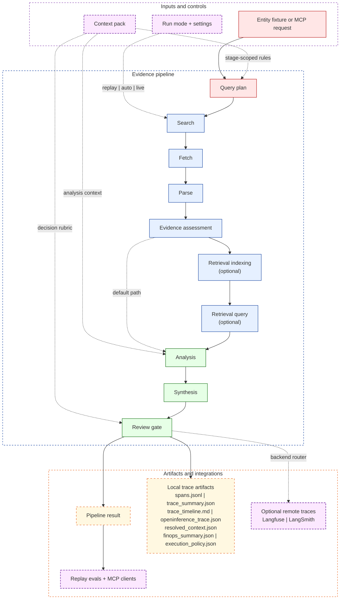

# Evidence Enrichment Engine

`evidence_enrichment` is a public-safe reconstruction of a production evidence-backed enrichment workflow. The repo is intentionally narrow: one entity fixture, one target field, one coordinator, one replay-first contract, and one inspectable decision path.

## Why This Repo Is Worth Reviewing

| Signal | Why it matters to a technical reviewer |
|---|---|
| Replay-first contract | The default demo path is deterministic, zero-network, and regression-friendly. |
| Context pack as runtime data | Stage-scoped instructions live in files, resolve into `resolved_context.json`, and stay inspectable after every run. |
| Explicit evidence pipeline | Query planning, search, fetch, parse, assessment, analysis, synthesis, and review are separate stages with local traces. |
| Hierarchical retrieval | Documents are chunked into a section tree; two-stage retrieval routes first to the right section (~50 comparisons) then to content within it (~30 comparisons), replacing a flat 1,500-chunk scan. |
| Schema-driven typed extraction | `ExtractionResult` sits alongside the existing `FactClaim` pipeline. A `SchemaExtractor` produces Pydantic-validated typed artifacts (row sums, currency checks, provenance enforcement) with an LLM repair loop and `SchemaValidationGate`. |
| Optional LangGraph retrieval path | Retrieval can stay off, run as local RAG, or run as a stateful retrieve-evaluate-refine loop without changing the base artifact contract. |
| Langfuse-first observability | `OBSERVABILITY_BACKEND` routes traces to Langfuse, LangSmith, both, or neither while local artifacts remain on by default. Redaction and summarizer helpers live in vendor-agnostic core modules (`redaction.py`, `summarizers.py`) so neither adapter owns shared privacy logic. |
| AI FinOps for agentic workflows | Per-stage cost estimation, budget-aware execution, and quality/latency/cost tradeoff reporting — all deterministic and replay-friendly. Repair loops are accounted for without double-counting: token totals are pre-summed per call before being passed to the cost estimator. |
| Execution policy layer | `off\|audit\|enforce` mode governs which live-capability surfaces are permitted. Policy decisions are recorded in `execution_policy.json` separately from FinOps artifacts. |
| MCP surface | MCP-compatible clients can invoke the replay-safe workflow without inventing a second integration layer. |

## Architecture At A Glance



Deep dives:

- [Goals and features](docs/goals_and_features.md)
- [Retrieval architecture](docs/retrieval.md)
- [Observability model](docs/observability.md)

## Quick Start

```bash
python -m venv .venv
. .venv/bin/activate
python -m pip install -e ".[dev]"

evidence-enrich demo --mode replay
evidence-enrich eval
```

Optional extras:

| Need | Install |
|---|---|
| Live providers | `python -m pip install -e ".[live]"` |
| Retrieval and LangGraph | `python -m pip install -e ".[retrieval]"` |
| Langfuse remote tracing | `python -m pip install -e ".[observability]"` |
| MCP server | `python -m pip install -e ".[mcp]"` |
| Guardrails extras | `python -m pip install -e ".[guardrails]"` |

## Redis Cache (Optional)

The pipeline supports optional Redis caching for fetch and evidence-assessment stages. Cache is completely optional — replay mode and all core functionality work without Redis.

### Setup

```bash
docker-compose up -d redis
export CACHE_ENABLED=true
evidence-enrich demo --mode live
```

### What Redis Adds

- **24-hour cache for fetched documents** — avoids repeated network calls for the same URL
- **7-day cache for evidence assessments** — avoids repeated scoring for the same content
- **Explicit staleness tracking** — cache age is visible in trace artifacts, separate from TTL expiration
- **Mode-isolated cache keys** — `live`, `replay`, and `auto` modes maintain separate caches to preserve replay determinism
- **Connection pooling** — max 10 Redis connections for performance
- **Graceful degradation** — pipeline continues without cache if Redis is unavailable

### What Redis Does NOT Add

- No queueing or worker coordination
- No write-through or write-back persistence
- No distributed state management
- Cache is bounded to fetch and assessment stages only

### Demo Sequence

Demonstrates cache miss → hit → stale progression:

```bash
# 1. Start Redis
docker-compose up -d redis
export CACHE_ENABLED=true

# 2. First run (cache miss)
evidence-enrich demo --mode live --entity-id deriv --field hq_country
# Observe: trace shows "Cache: 0 hits, 3 misses, 0 stale"
# Observe: fetch latency ~1800ms

# 3. Second run (cache hit)
evidence-enrich demo --mode live --entity-id deriv --field hq_country
# Observe: trace shows "Cache: 3 hits, 0 misses, 0 stale"
# Observe: fetch latency ~8ms (225x faster)

# 4. Inspect trace artifacts
cat examples/output/traces/<trace-id>/trace_timeline.md
# Shows cache metadata for each stage

# 5. Verify replay mode independence
export CACHE_ENABLED=false
evidence-enrich demo --mode replay
# Observe: works without Redis, no cache metadata in traces
```

### Why Redis Instead of PostgreSQL

The cache implementation makes this answer trace-visible:

1. **Sub-millisecond read latency** — Redis: ~8ms for cache hit vs PostgreSQL: ~20-50ms query overhead even with indexes
2. **Built-in TTL expiration** — Redis: `SETEX` with automatic eviction vs PostgreSQL: requires background job or manual cleanup queries
3. **Connection pooling optimized for reads** — Redis: minimal overhead for high-throughput reads vs PostgreSQL: heavier connection management designed for transactional workloads
4. **Operational simplicity** — Redis: single-purpose cache, minimal configuration vs PostgreSQL: requires schema, migrations, indexes, vacuum tuning
5. **Hot-path optimization** — Redis: in-memory, sub-millisecond reads vs PostgreSQL: disk-backed (even with caching), query planning overhead

The trace artifacts prove the point: 225x speedup on cache hits, with explicit staleness tracking and graceful degradation.

## Execution Modes

### Pipeline mode

| Mode | What it does | Typical use |
|---|---|---|
| `replay` | Forces replay bundles; no provider API keys or network access required | Default demo and regression work |
| `auto` | Tries live providers when credentials are present, otherwise falls back to replay when a bundle exists | Developer convenience |
| `live` | Forces live provider calls | Manual end-to-end validation |

### Retrieval mode

| `retrieval.mode` | Behavior |
|---|---|
| `off` | Default path. `analysis` uses the parsed document text directly. |
| `local` | Accepted documents are chunked, embedded into Chroma, and queried before `analysis`. |
| `agent` | Wraps retrieval in a LangGraph stateful loop that can retrieve, evaluate, and refine before returning chunks to `analysis`. |

Replay mode skips retrieval entirely even if retrieval is configured. That preserves the zero-network default demo path and keeps replay bundles unchanged.

## Observability

Every run always writes local trace artifacts under `examples/output/traces/<trace_id>/`.

Remote backend selection is controlled by one env var:

```bash
OBSERVABILITY_BACKEND=langfuse   # default
OBSERVABILITY_BACKEND=langsmith
OBSERVABILITY_BACKEND=dual
OBSERVABILITY_BACKEND=none
```

Observability behavior:

- Langfuse is the default and primary remote path.
- LangSmith remains fully supported as an alternative backend.
- Missing remote credentials never crash the pipeline; the run falls back to local-artifact-only tracing.
- `TRACE_REDACT_VALUES=true` is the default, so sensitive values are redacted before remote emission.

Privacy note:

- Langfuse uses `capture_input=False` and `capture_output=False`, so it receives compact stage summaries rather than automatic full prompt/response capture.
- Raw prompts and LLM responses are only sent remotely when LangSmith is active and `TRACE_REDACT_VALUES=false`.
- With the default `TRACE_REDACT_VALUES=true`, LangSmith client wrapping is disabled and sensitive summary fields are redacted before leaving the process.

See [docs/observability.md](docs/observability.md) for backend setup, redaction rules, credential eviction, and process-global caveats.

The observability layer is structured as:

| Module | Role |
|---|---|
| `observability/redaction.py` | Vendor-agnostic redaction constants and helpers (`should_redact`, `maybe_redact`) |
| `observability/summarizers.py` | Vendor-agnostic stage summarizers (`summarize_*`, `trace_payload_inputs`) |
| `observability/langfuse.py` | Langfuse adapter: env sync, client, flush, `observe` decorator, `record_stage_observation` |
| `observability/langsmith.py` | LangSmith adapter: env sync, client, flush |
| `observability/router.py` | Backend selector (`OBSERVABILITY_BACKEND` resolution) |
| `observability/runtime.py` | Task-local config, credential eviction, policy-gated activation |

## AI FinOps

The pipeline includes cost-aware model routing and budget-aware execution so every run produces machine-readable cost attribution alongside quality and latency metrics.

Key capabilities:

- **Stage-level cost attribution**: analysis, synthesis, and retrieval embedding costs are estimated per-run.
- **Budget-aware execution**: `budget_mode=off|warn|strict` controls whether runs are measured, flagged, or actively governed.
- **Same-provider tiered routing**: strict mode can downgrade to a cheaper model within the same provider before blocking.
- **Deterministic estimation**: all cost numbers use a reproducible `chars/4` token heuristic and a versioned static pricing catalog — not provider billing.
- **FinOps eval report**: `evidence-enrich eval` produces `evals/output/latest_finops_report.json` with per-case and aggregate cost/latency/quality data.

```yaml
# evidence_enrichment.yaml
finops:
  enabled: true
  budget_mode: "off"
  openai_cheap_model: "gpt-5-mini"
  anthropic_cheap_model: "claude-sonnet-4.6"
```

Costs are **estimated**, not billed. See [docs/observability.md](docs/observability.md) for details.

## Execution Policy

The execution policy layer governs **capability** — which live-capability surfaces are permitted to run. It is separate from FinOps, which governs **cost**.

| `execution_policy.mode` | Behavior |
|---|---|
| `off` | No policy enforcement. All actions proceed. Artifact still written with empty decisions list. |
| `audit` | All actions proceed. Policy violations are recorded in `execution_policy.json` but never block the run. |
| `enforce` | Disallowed actions are blocked. The run returns a structured `PipelineRunResult` with `gate_reason="policy_blocked:<action>"` instead of raising an exception. The block is also recorded in `execution_policy.json`. |

Governed action surfaces:

| Action | What it covers |
|---|---|
| `search` | Live web search calls |
| `fetch` | Live URL fetches |
| `retrieval` | Retrieval indexing and query (LangGraph or local RAG) |
| `remote_tracing` | Langfuse / LangSmith trace egress |
| `live_provider_calls` | Any live LLM provider API call |
| `mcp_live_runs` | MCP-triggered live execution paths |

Configuration:

```yaml
# evidence_enrichment.yaml
execution_policy:
  enabled: true
  mode: "off"          # off | audit | enforce
  allowed_actions:
    - search
    - fetch
    - retrieval
    - remote_tracing
    - live_provider_calls
    - mcp_live_runs
```

Each run writes `execution_policy.json` alongside `finops_summary.json` in `examples/output/traces/<trace_id>/`. Both artifacts are independently inspectable.

See [docs/observability.md](docs/observability.md) for artifact schema, gate reasons, and configuration details.

## Retrieval And LangGraph

The retrieval layer is optional and deliberately scoped. It exists to show a stateful evidence-selection pattern without changing the public artifact contract.

- `local` mode adds `retrieval_indexing` and `retrieval_query` stages between `evidence_assessment` and `analysis`.
- `agent` mode uses a LangGraph `StateGraph` for retrieve-evaluate-refine iteration and records `agent_iterations` in the `retrieval_query` span.
- The `retrieval_query` span includes a `retrieval_score_breakdown` field listing per-chunk vector, keyword, table-boost, and fused scores — inspectable in `spans.jsonl`.
- Retrieval is document-scoped, so each `FactClaim.source_url` stays attributable to the document that produced it.

### Retrieval mode

| `retrieval.mode` | Behavior |
|---|---|
| `off` | Default path. `analysis` uses the parsed document text directly. |
| `local` | Accepted documents are chunked, embedded into Chroma, and queried before `analysis`. |
| `agent` | Wraps retrieval in a LangGraph stateful loop that can retrieve, evaluate, and refine before returning chunks to `analysis`. |

Replay mode skips retrieval entirely even if retrieval is configured, preserving the zero-network default demo path.

### Chunker and retriever

| `retrieval.chunker` | `retrieval.retriever` | Behavior |
|---|---|---|
| `flat` (default) | `hybrid` (default) | `TableAwareChunker` + `HybridRetriever` — existing single-stage vector+keyword+table scan. |
| `hierarchical` | `hierarchical` | `HierarchicalChunker` builds a section tree; `HierarchicalRetriever` routes Stage 1 to ~50 section-summary chunks, then Stage 2 to content within matched sections (~30 comparisons). Falls back to full-document scan for documents indexed before hierarchical chunking. |

Setting `retriever="hierarchical"` with `chunker="flat"` automatically promotes `chunker` to `"hierarchical"` with a warning, since the section-summary chunks required by Stage 1 are only produced by `HierarchicalChunker`.

See [docs/retrieval.md](docs/retrieval.md) and [docs/hierarchical_retrieval_upgrade.md](docs/hierarchical_retrieval_upgrade.md) for chunking, scoring, config, and the LangGraph loop.

## Schema Extraction

When `schema_validation=True` in `RetrievalConfig`, a parallel typed extraction path runs *in addition to* the existing `FactClaim` pipeline — it does not replace synthesis or the review gate.

Key design points:

- **`ExtractionResult`** is a Pydantic model wrapping a typed schema instance (e.g. `GeographicRevenueExtraction`). It round-trips through `model_dump` / `model_validate` via an embedded `__schema_cls__` tag.
- **`SchemaExtractor`** sends a retrieval-grounded prompt to the configured provider, validates the JSON response against the registered schema, and retries up to `schema_repair_max_attempts` times using `SchemaRepairHelper` on `ValidationError`.
- **`SchemaValidationGate`** classifies errors as hard fails (row-sum divergence, missing provenance) or soft fails (percentage-sum off, unit mismatch) and applies a confidence penalty to soft fails.
- **Partial-payload typing**: on the failure path, `_coerce_nested_fields` coerces both list fields (`list[SomeModel]`) and scalar `BaseModel | None` fields to typed instances via `model_construct`, so downstream code does not receive raw dicts for structurally valid sub-objects.
- **FinOps repair-loop accuracy**: each provider call's token count is estimated individually and pre-summed before being passed to the cost estimator — avoiding the N× overcount that would occur if concatenated text were passed with `call_count=N`.

Registered schemas: `geographic_revenue`, `segment_revenue`, `scope_1_emissions`, `scope_2_emissions`, `headcount_by_region`.

```yaml
# evidence_enrichment.yaml
retrieval:
  schema_validation: true
  schema_repair_max_attempts: 2
```

See [docs/hierarchical_retrieval_upgrade.md](docs/hierarchical_retrieval_upgrade.md) for the full design and implementation notes.

## MCP Server

The repo exposes an MCP server so MCP-compatible clients can invoke the workflow directly.

```bash
python -m pip install -e ".[mcp]"

evidence-enrich mcp
evidence-enrich mcp --transport streamable-http

evidence-enrich-mcp
evidence-enrich-mcp --transport streamable-http
```

MCP defaults to replay mode, so the server works without provider credentials.

## Results Snapshot

| Path | Expected outcome | Decision | Confidence |
|---|---|---|---|
| Baseline replay | `USA` from weak secondary evidence | `needs_review` | `0.75` |
| Assessed replay | `USA` from agreeing primary sources | `auto_approve` | `0.97` |
| Eval harness | replay cases pass against expectations | `6/6 pass` | case-dependent |

Replay bundles included in the repo:

| Bundle name | Expected decision | Notes |
|---|---|---|
| `microsoft_hq_country` | `auto_approve` | Two agreeing high-authority sources |
| `microsoft_hq_country_baseline` | `needs_review` | Weak secondary evidence only |
| `microsoft_hq_country_conflict` | `needs_review` | Conflicting claims across sources |
| `microsoft_hq_country_no_support` | `auto_reject` | No accepted claims found |
| `microsoft_hq_country_invalid_iso3` | `auto_reject` | Non-ISO3 synthesis output |
| `microsoft_hq_country_low_signal` | `needs_review` | Single low-confidence claim |

## Docker

```bash
cp .env.example .env
docker compose up
```

Useful container commands:

```bash
docker compose run --rm pipeline pytest tests/
docker compose run --rm pipeline evidence-enrich eval
docker compose run --rm pipeline evidence-enrich demo --mode auto
```

## GCP Deployment

The pipeline can be deployed to Google Cloud Platform as a scheduled batch processor using Cloud Run Jobs with Terraform infrastructure.

### Architecture

- **Cloud Run Jobs** for batch execution (not HTTP service)
- **Memorystore Redis** for caching (24h documents, 7d evidence)
- **Secret Manager** for API keys (Langfuse + 4 provider keys)
- **Cloud Scheduler** for periodic triggers via OAuth token
- **GCS bucket** for trace artifacts
- **VPC Connector** for Cloud Run to Redis connectivity

### Quick Start

```bash
# Set environment (dev, staging, or prod)
export ENVIRONMENT=dev

# Initialize Terraform with remote state
terraform -chdir=terraform/gcp init \
  -backend-config="bucket=${ENVIRONMENT}-evidence-enrichment-tfstate" \
  -backend-config="prefix=terraform/state"

# Review plan
terraform -chdir=terraform/gcp plan \
  -var-file="../environments/${ENVIRONMENT}.tfvars"

# Apply infrastructure
terraform -chdir=terraform/gcp apply \
  -var-file="../environments/${ENVIRONMENT}.tfvars"
```

### Cost Estimation

| Environment | Monthly Cost | Key Resources |
|---|---|---|
| Dev | $40-50 | Basic Redis (1GB), minimal job executions |
| Staging | $60-80 | Basic Redis (2GB), moderate job executions |
| Prod | $200-250 | Standard Redis (5GB) with HA, hourly job executions |

See [docs/deployment_gcp.md](docs/deployment_gcp.md) for complete deployment guide, prerequisites, and operational details.

See [docs/architecture_decisions.md](docs/architecture_decisions.md) for rationale behind Cloud Run Jobs choice, Redis caching strategy, and execution policy design.

## CI And Development

GitHub Actions CI lives in [`.github/workflows/ci.yml`](.github/workflows/ci.yml) and currently:

1. installs `.[dev]`
2. runs `pytest tests/`
3. runs `ruff check .`

Equivalent local commands:

```bash
pytest tests/
evidence-enrich eval
ruff check .
```

## Repo Layout

```text
context/
docs/
evals/
examples/
evidence_enrichment/
tests/
```

## Honesty Note

This is a public-safe demo of patterns used to structure and inspect agentic workflows. It is deliberately small, local, and replay-driven. It is not presented as a full production observability stack or a general-purpose agent platform.
