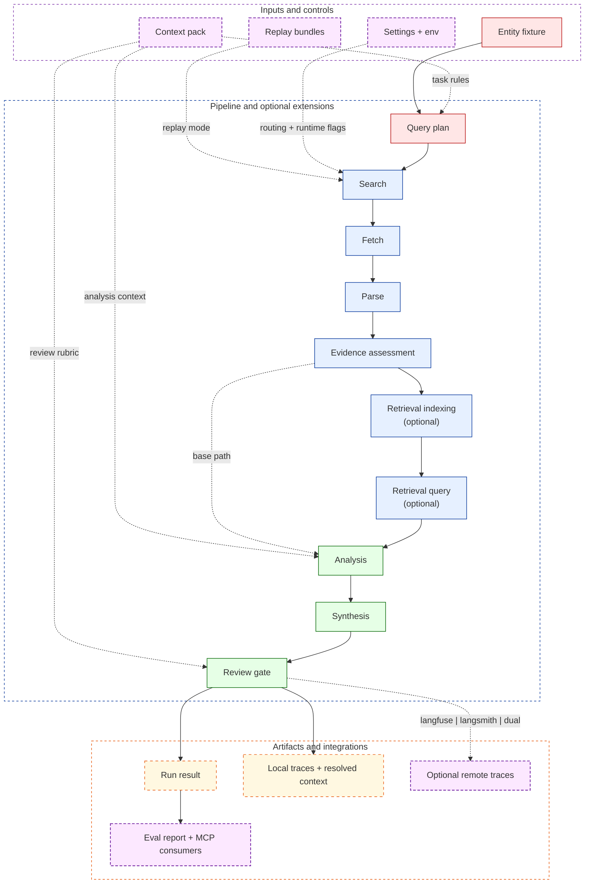

# Goals And Features

`evidence_enrichment` exists to demonstrate a disciplined evidence-backed enrichment pattern rather than a generic agent shell. The interesting part is not that an LLM is called. The interesting part is the contract around that call: explicit context, staged evidence handling, replay-safe evaluation, inspectable traces, and a review gate that can refuse weak outputs.

## Goal

Show how to resolve one structured field from public evidence through a replay-first pipeline with inspectable decisions, optional stateful retrieval, and privacy-aware observability.

## Review Signals

| Signal | What is implemented |
|---|---|
| Context engineering | Stage-scoped context files live under `context/` and resolve into `resolved_context.json` on every run. |
| Evidence-first execution | The pipeline separates query planning, acquisition, parsing, evidence assessment, reasoning, synthesis, and review. |
| Replay-backed regression surface | The demo ships replay bundles and an eval harness so behavior can be checked without live providers. |
| LangGraph as a real path | Retrieval can run as an actual `StateGraph` loop rather than a roadmap claim. |
| Langfuse-first observability | `OBSERVABILITY_BACKEND=langfuse` is the documented default, with `langsmith`, `dual`, and `none` still supported. |
| Safe public framing | The repo preserves architecture and execution flow while removing proprietary inputs and internal infrastructure claims. |

## System View

## Feature Areas

| Area | Implemented behavior | Why it matters |
|---|---|---|
| Context pack | `system_role.md`, `task_spec.md`, `data_contracts.md`, `failure_modes.md`, `decision_rubric.md`, and `context_manifest.yaml` define the workflow context. | Context is versioned as data instead of disappearing into a prompt string inside code. |
| Core pipeline | `query_plan -> search -> fetch -> parse -> evidence_assessment -> analysis -> synthesis -> review_gate` is the stable base path. | Each boundary is inspectable, testable, and traceable. |
| Retrieval extension | `retrieval_indexing` and `retrieval_query` activate only when `retrieval.mode` is `local` or `agent`. | Retrieval is additive, not a breaking redesign of the base workflow. |
| LangGraph path | `retrieval.mode=agent` runs a retrieve-evaluate-refine loop through a LangGraph `StateGraph`. | The repo shows a real stateful orchestration pattern instead of only claiming compatibility with one. |
| Replay mode | Bundled replay scenarios preserve a zero-network demo and regression baseline. | Reviewers can inspect behavior without needing external credentials or unstable websites. |
| Observability | Local traces are always written; remote routing is controlled by `OBSERVABILITY_BACKEND`. | Local debugging never depends on remote SDK state, and privacy controls are explicit. |
| Eval harness | `evidence-enrich eval` checks expected value, expected decision, and minimum confidence on replay cases. | The repo demonstrates repeatable evaluation, not just a happy-path demo. |
| MCP surface | The MCP server exposes replay-safe tools and resources over stdio or streamable HTTP. | The pipeline can be consumed by AI clients without inventing a separate adapter layer. |
| Guardrails | Post-synthesis checks can reject low-confidence or invalid outputs before return. | The final answer is gated by policy rather than treated as automatically safe. |
| AI FinOps | Per-stage cost estimation, budget-aware execution policies, and quality/latency/cost tradeoff reporting. | The workflow measures cost, enforces budgets, and shows tradeoffs in a reproducible way. |
| Execution Policy | Capability-governance layer (`off` / `audit` / `enforce`) that gates live actions (search, fetch, retrieval, remote tracing, MCP live runs) independently of cost controls. | Operators can restrict which live surfaces are permitted at runtime without touching FinOps config. |
| GCP Deployment | Production-ready Terraform infrastructure for Cloud Run Jobs with Memorystore Redis, Secret Manager, and Cloud Scheduler. | The pipeline can be deployed to GCP as a scheduled batch processor with full observability and cost optimization. |

## Observability Positioning

The public framing after the Langfuse-first upgrade is:

1. Langfuse is the primary documented remote tracing path.
2. LangSmith remains supported.
3. `dual` remains available for side-by-side tracing.
4. `none` still preserves the local artifact contract.
5. `TRACE_REDACT_VALUES=true` is the default, so remote traces stay privacy-safe unless explicitly relaxed.

See [observability.md](observability.md) for the runtime behavior and credential lifecycle details.

## Retrieval Positioning

The public framing for retrieval is intentionally conservative:

1. Retrieval is optional and does not change replay bundles.
2. `local` mode is a bounded Chroma-backed RAG path.
3. `agent` mode is the current LangGraph stateful workflow path.
4. Document attribution remains per-source because retrieval is document-scoped.

See [retrieval.md](retrieval.md) for chunking, scoring, config, and the LangGraph loop.

## Verification Surface

| Surface | What it checks |
|---|---|
| `tests/test_observability.py` | Backend routing, privacy defaults, runtime overrides, credential eviction, and tombstone behavior |
| `tests/test_pipeline.py` | End-to-end pipeline behavior and artifact generation |
| `tests/test_retrieval_agent.py` | Retrieval-agent orchestration and replay boundaries |
| `tests/test_mcp_server.py` | MCP tools, resources, and transport-safe defaults |
| `tests/test_execution_policy.py` | Policy models, engine (all three modes), config surface, `execution_policy.json` artifact, coordinator smoke paths, and remote-tracing policy gate |
| `tests/test_agents.py` | Live agent LLM usage capture (provider-reported and estimated fallback) |
| `tests/` | Full local regression suite exercised by CI |
| [`.github/workflows/ci.yml`](../.github/workflows/ci.yml) | Installs `.[dev]`, runs `pytest tests/`, then `ruff check .` |

## What This Repo Does Not Try To Be

- It is not a bulk enrichment platform across large entity universes.
- It is not a generic multi-agent supervisor framework.
- It is not a production telemetry stack claim.
- It does not replace the separate document acquisition or lakehouse repos.
