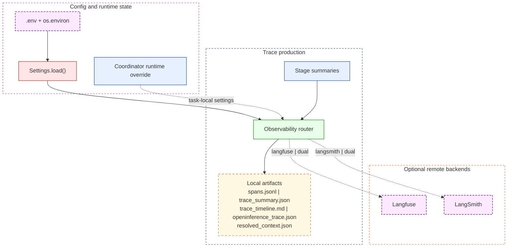

# Observability

The pipeline always writes local trace artifacts. Remote tracing is optional and routed through a single backend selector so Langfuse can be the primary path without removing LangSmith support.

## Observability System View



## Backend Selection

`OBSERVABILITY_BACKEND` chooses which remote backend receives traces:

| Value | Behavior |
|---|---|
| `langfuse` | Langfuse only. This is the default. |
| `langsmith` | LangSmith only. |
| `dual` | Emit to both Langfuse and LangSmith. |
| `none` | Disable remote traces while keeping all local artifacts. |

```bash
# .env
OBSERVABILITY_BACKEND=langfuse
```

If the selected remote backend is missing credentials, the pipeline does not crash. It falls back to local-artifact-only tracing.

## Resolution Order

Observability settings resolve in this order:

1. Task-local runtime overrides installed by `EvidenceCoordinator.run()`.
2. The last successful `Settings.load()` snapshot for the current process.
3. `os.environ` and `.env` fallback when no loaded settings snapshot exists.

That means a direct `os.environ` mutation does not override an already-loaded settings object until the next explicit `Settings.load()`.

## Local Artifacts

Every run writes:

- `spans.jsonl`
- `trace_summary.json`
- `trace_timeline.md`
- `openinference_trace.json`
- `resolved_context.json`

These files live under `examples/output/traces/<trace_id>/` and remain the stable local contract regardless of remote backend selection.

## Remote Payloads

Remote tracing uses compact stage summaries across these spans:

- `query_plan`
- `search`
- `fetch`
- `parse`
- `evidence_assessment`
- `retrieval_indexing` when `retrieval.mode` is `local` or `agent`
- `retrieval_query` when `retrieval.mode` is `local` or `agent`
- `analysis`
- `synthesis`
- `review_gate`

Representative summary fields:

- `query_plan`: entity id, field, company name, query counts, resolved context ids
- `search`: query text, provider order, result count, top URLs
- `fetch`: requested URLs, fetched count, success count
- `parse`: document URLs, titles, text-length summaries
- `analysis`: accepted document URLs, claim count, candidate values
- `synthesis`: selected value, supporting URLs, conflict count, confidence
- `review_gate`: final decision, gate reason, overall confidence

## Remote Behavior By Backend

| Backend | Default remote payload | Raw prompt / response capture |
|---|---|---|
| Langfuse | Compact stage summaries only | No. `capture_input=False` and `capture_output=False` disable automatic full IO capture. |
| LangSmith with `TRACE_REDACT_VALUES=true` | Compact redacted stage summaries | No. LangSmith client wrapping is disabled when redaction is on. |
| LangSmith with `TRACE_REDACT_VALUES=false` | Compact stage summaries plus wrapped model-client traces | Yes. Raw prompts and full LLM responses can be captured in your LangSmith project. |

## Quick Start

### Langfuse (primary path)

```bash
python -m pip install -e ".[observability]"
```

```bash
# .env
OBSERVABILITY_BACKEND=langfuse
LANGFUSE_SECRET_KEY=sk-lf-...
LANGFUSE_PUBLIC_KEY=pk-lf-...
LANGFUSE_BASE_URL=https://cloud.langfuse.com
```

Legacy `LANGFUSE_HOST` is still accepted as an alias for `LANGFUSE_BASE_URL`.

### LangSmith (supported alternative)

```bash
# .env
OBSERVABILITY_BACKEND=langsmith
LANGSMITH_TRACING=true
LANGSMITH_API_KEY=...
LANGSMITH_PROJECT=evidence-enrichment-engine
```

Legacy `LANGCHAIN_TRACING_V2`, `LANGCHAIN_API_KEY`, and `LANGCHAIN_PROJECT` values are still honored for compatibility.

### Dual mode

```bash
# .env
OBSERVABILITY_BACKEND=dual
LANGFUSE_SECRET_KEY=sk-lf-...
LANGFUSE_PUBLIC_KEY=pk-lf-...
LANGFUSE_BASE_URL=https://cloud.langfuse.com
LANGSMITH_TRACING=true
LANGSMITH_API_KEY=...
```

### Local-only mode

```bash
# .env
OBSERVABILITY_BACKEND=none
```

## Privacy And Redaction

`TRACE_REDACT_VALUES=true` is the default.

With redaction enabled:

1. Sensitive fields are replaced with `[REDACTED]` before remote emission.
2. LangSmith client wrapping is disabled, so raw prompts and full LLM responses are not sent to LangSmith.
3. Langfuse still receives compact stage summaries, but not automatic full IO capture.

To disable redaction in a non-sensitive environment:

```bash
TRACE_REDACT_VALUES=false
```

Fields redacted from stage summaries include:

- candidate values and normalized values
- supporting URLs and source URLs
- search URLs and primary query text
- company name and context entry ids
- nested document URLs in summarized payloads

Structural fields such as counts, scores, decisions, and latency remain intact so traces stay useful.

## Credential Rotation And Revocation

`clear_ambient_credentials()` is the explicit in-process eviction path for observability credentials.

```python
from evidence_enrichment.config import clear_ambient_credentials

clear_ambient_credentials()
clear_ambient_credentials("langfuse")
clear_ambient_credentials("langsmith")
```

What it does:

1. Removes the selected credentials from `os.environ`.
2. Removes them from the in-process ambient and managed settings caches.
3. Marks them eviction-pending so the next `Settings.load()` does not re-capture them from stale in-process state.
4. Records secret tombstones so the same stale secret value is blocked until the credential is rotated.

Important revocation notes:

- Tombstone creation is order-independent. Both evict-then-deactivate and deactivate-then-evict block the same stale secret value.
- Rotated credentials are accepted normally because the tombstone is cleared when the value changes.
- Tombstones only protect the running process. Remove stale values from `.env` too.
- For hard revocation after a leak, restart the process.

Recommended long-lived-process sequence:

1. Call `clear_ambient_credentials()`.
2. Call `Settings.load()` with the desired backend state.
3. Remove stale secrets from `.env` or any other config source.
4. Restart the process.

## Process-Global Caveat

Observability state is serialized by a process-wide lock, so `Settings.load()` and credential-eviction paths do not interleave half-written state.

That does not make the config multi-tenant safe.

- The active settings snapshot is still process-global.
- Remote SDK env is still process-global.
- Hot-switching credentials or backends inside a long-lived server remains operationally risky.

Recommended usage:

1. Call `Settings.load()` once at startup.
2. Avoid per-request backend changes.
3. Prefer full process restart for revocation or backend changes.

## Viewing Traces

1. Run a traced command such as `evidence-enrich demo --mode replay`.
2. Inspect the local trace directory under `examples/output/traces/<trace_id>/`.
3. If a remote backend is active, open the corresponding Langfuse or LangSmith run tree.
4. Compare the compact remote stage summaries with the richer local artifacts on disk.
