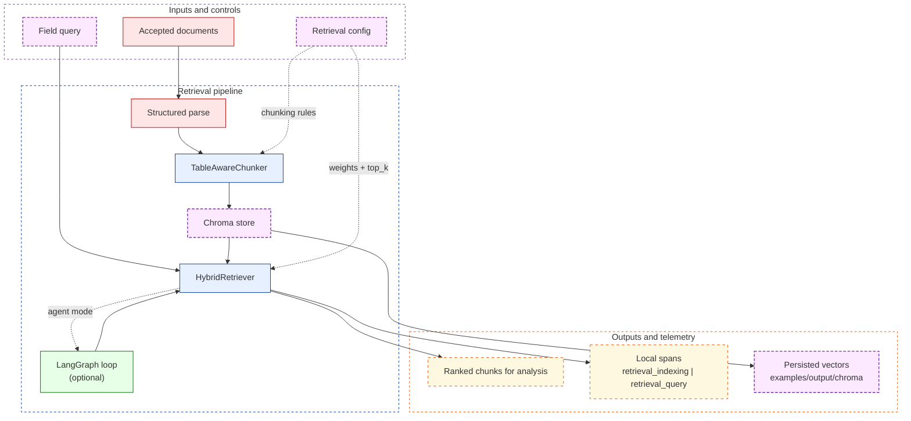
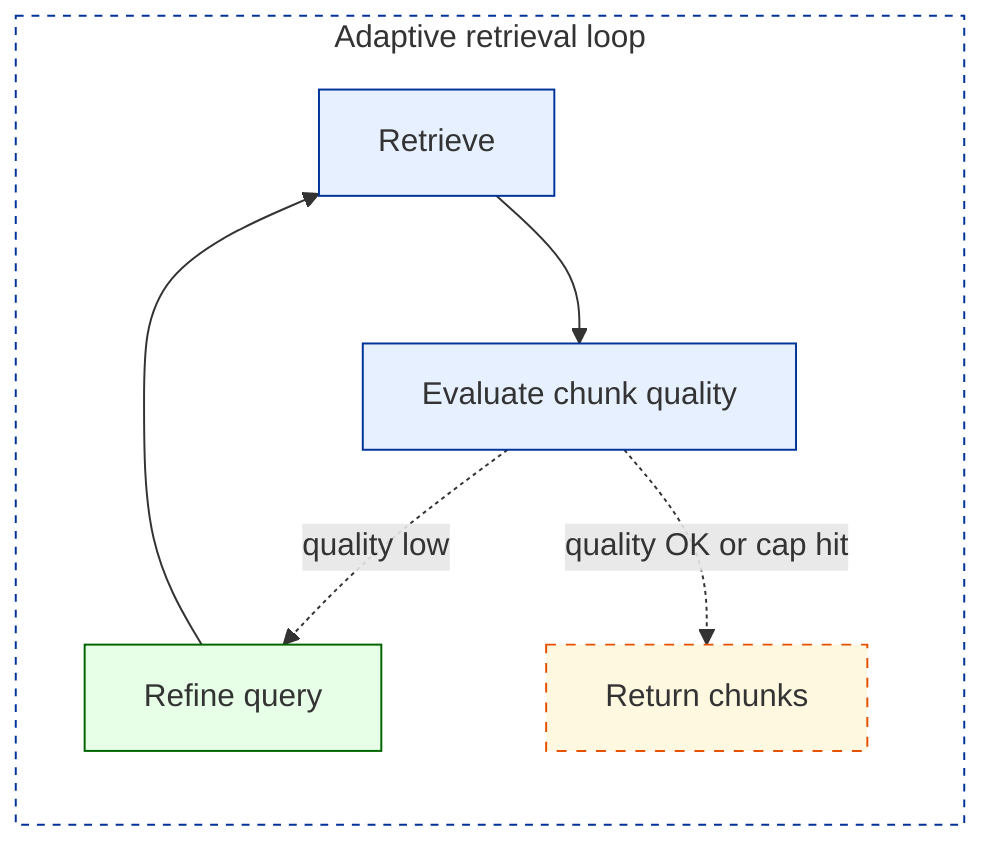

# Retrieval

The retrieval layer is optional. When enabled, it inserts a bounded RAG step between `evidence_assessment` and `analysis` so the analysis prompt can work from semantically ranked document chunks instead of a fixed `text[:6000]` truncation.

The design goal is not "add more AI." The design goal is to make evidence selection explicit while preserving the replay-first artifact contract.

## Retrieval System View



## Mode Comparison

| `retrieval.mode` | Behavior | Operational notes |
|---|---|---|
| `off` | No retrieval stages are added. `analysis` works from the parsed document text directly. | Default behavior. Replay bundles and artifacts stay unchanged. |
| `local` | Accepted documents are chunked, embedded, stored in Chroma, and queried before `analysis`. | Requires the `[retrieval]` extra and `OPENAI_API_KEY` for embeddings in live mode. |
| `agent` | Runs the same retrieval stack, but query refinement is managed by a LangGraph `StateGraph`. | Adds `agent_iterations` to the `retrieval_query` span so loop depth is inspectable. |

Replay mode skips retrieval entirely even if retrieval is configured. That preserves the zero-network demo path and avoids changing stored replay bundles.

## Pipeline Placement

Base path:

```text
query_plan -> search -> fetch -> parse -> evidence_assessment -> analysis -> synthesis -> review_gate
```

Retrieval-enabled path:

```text
query_plan -> search -> fetch -> parse -> evidence_assessment -> retrieval_indexing -> retrieval_query -> analysis -> synthesis -> review_gate
```

The retrieval stages are additive. They do not rename, remove, or replace the rest of the pipeline contract.

## Chunking Strategy

The `TableAwareChunker` is intentionally conservative because the workflow is evidence-oriented rather than chatbot-oriented.

| Chunk type | Rule | Why it exists |
|---|---|---|
| HTML tables and plain-text tables | Keep as one chunk when the table fits within `max_table_size` | Row and column relationships matter for numeric evidence |
| Large tables | Split on whitespace boundaries without overlap | Avoid duplicate numeric rows across adjacent chunks |
| Normal text blocks | Character-based chunking with overlap | Preserve local context while keeping embedding payloads bounded |
| Very small blocks | Drop below `min_size` | Avoid noisy low-information chunks |

Defaults:

- `chunk_size=1500`
- `overlap=200`
- `min_size=80`
- `max_table_size=4000`

When retrieval is active, parsing uses the structured path so headings, tables, and plain-text table heuristics can be preserved before chunking.

## Scoring Formula

The `HybridRetriever` combines semantic similarity, lexical overlap, and a table bias:

```text
score = 0.7 * vector_score + 0.2 * keyword_score + 0.1 * table_boost
```

| Signal | Source | Range | Purpose |
|---|---|---|---|
| `vector_score` | Chroma cosine similarity transformed into similarity space | `[0, 1]` | Captures semantic relevance |
| `keyword_score` | `|query_terms ∩ chunk_terms| / |query_terms|` | `[0, 1]` | Preserves exact lexical anchors for numeric or named evidence |
| `table_boost` | Applied when the chunk is table-like and the query is numeric/financial | `{0, 0.1}` | Prioritizes structured evidence when tables are likely to matter |

The weights are configurable in `evidence_enrichment.yaml` under `retrieval.weights`.

## Document-Scoped Retrieval

Retrieval is filtered by `document_url`, not run across the full accepted-document pool.

That constraint is deliberate:

1. `analysis` produces claims that must stay attributable to the source document.
2. `FactClaim.source_url` would become misleading if a claim nominally attributed to document A used chunks from document B.
3. Cross-document synthesis already happens later at the `synthesis` stage where claims are pooled explicitly.

## LangGraph Adaptive Loop

`retrieval.mode=agent` wraps the retriever in a LangGraph loop that can iterate before handing chunks to `analysis`.



Operational details:

- The loop stops when the average chunk score clears the quality threshold.
- The loop also stops when the configured iteration cap is reached.
- The number of retrieve-evaluate cycles is recorded as `agent_iterations` on the `retrieval_query` span.

## Config Reference

```yaml
retrieval:
  mode: "off"               # "off" | "local" | "agent"
  persist_path: examples/output/chroma
  chunk_size: 1500
  overlap: 200
  max_table_size: 4000
  top_k: 5
  embedding_model: text-embedding-3-small
  min_doc_chars: 2000
```

| Key | Meaning | Default |
|---|---|---|
| `mode` | Retrieval execution mode | `off` |
| `persist_path` | Chroma persistence directory | `examples/output/chroma` |
| `chunk_size` | Target text chunk size in characters | `1500` |
| `overlap` | Character overlap between text chunks | `200` |
| `max_table_size` | Maximum chars before a table is split | `4000` |
| `top_k` | Number of ranked chunks returned per document | `5` |
| `embedding_model` | Embedding model used for indexing and retrieval | `text-embedding-3-small` |
| `min_doc_chars` | Minimum document length to index | `2000` |

## Install And Run

```bash
python -m pip install -e ".[retrieval]"
```

Example config:

```yaml
# evidence_enrichment.yaml
retrieval:
  mode: "agent"
```

Example run:

```bash
evidence-enrich run --entity examples/microsoft.json --field hq_country --mode live
```

`OPENAI_API_KEY` is required for live retrieval because chunk embeddings are created with the OpenAI embeddings API.

## Operational Boundaries

- Replay mode skips retrieval entirely.
- Chroma data lives under `examples/output/chroma/` and is covered by `.gitignore`.
- Retrieval does not change the local trace artifact contract; it only adds `retrieval_indexing` and `retrieval_query` spans when active.
- The replay analysis agent accepts `retrieved_chunks` for interface compatibility but ignores them in replay mode.
